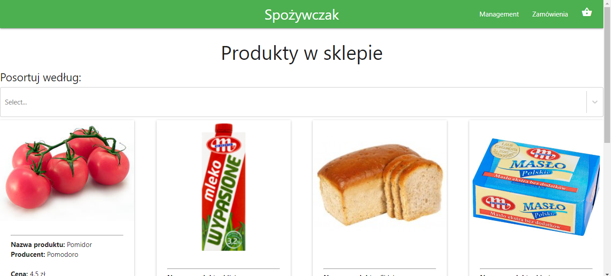
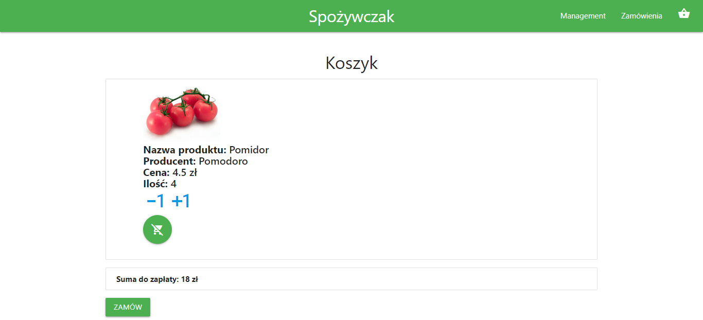
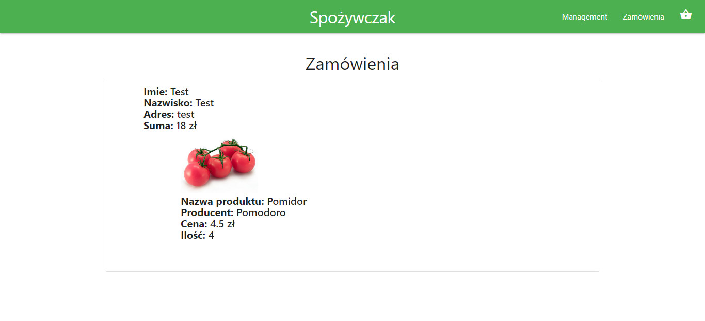
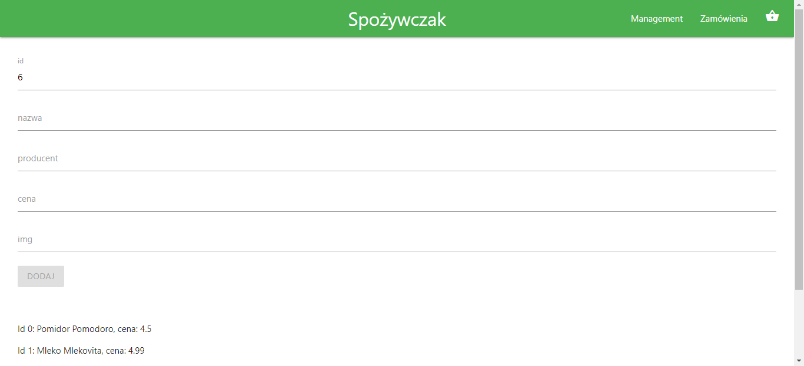

## Grocery Shop

Grocery Shop that is Single Page Application (SPA). The main goal was to made a shop where you can browse products, add them to cart and make an order. Whst's more you can manage the products in the shop ( add, edit, delete ). The application was created to pass the classes - Internet Applications Based on Components

## Technologies

Application was made in ReactJs with Node.js web framework - Express.js ( server API ). The visual side of application was made with front-end framework Materialize and of course HTML/CSS.

## Functionalities

* Add, Edit, Delete products in shop
* Sort products by Price, Name and Manufacturer
* Add roducts to Cart
* Change amount of product in Cart
* Remove product from Cart
* Make order for products in Cart

## Illustrations
### Home

### Cart

### Order

### Management

## Authors
* Jasiński Piotr
* Zaorski Michał
